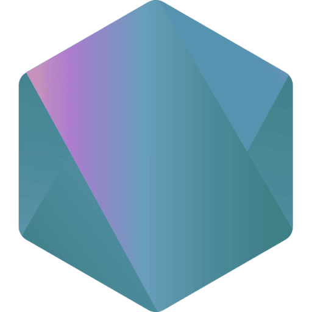

> [!IMPORTANT]
> ▮▮▮▮▮▮▮▮▮▮▮▯▯▯▯▯<br>
> **69%** ```Loading Brain Cells...```

<details "skills">
   <summary> 
       My Skills 
   </summary> 
   <p> <div height="top" align="bottom">
      <a href="https://en.wikipedia.org/wiki/JavaScript" title="JavaScript"></a> 
      <a href="https://www.typescriptlang.org/" title="TypeScript"></a> 
      <a href="https://tailwindcss.com/" title="Tailwind CSS"></a> 
      <a href="https://svelte.dev/" title="Svelte"></a> 
      <a href="https://nodejs.org/" title="Node.js"></a> 
      <br>
   </p> </div>
</details>

Some stuff I made: <br>
      ➥ <br>
      ➥ <br>
<div align="center">   
   
<picture>
  <source media="(prefers-color-scheme: dark)" srcset="https://github-readme-activity-graph.vercel.app/graph?username=kuran1x&theme=react-dark&hide_border=true&hide_title=true&bg_color=0D111007&height=335&point=f0fcff">
  <source media="(prefers-color-scheme: light)" srcset="https://github-readme-activity-graph.vercel.app/graph?username=kuran1x&theme=react-dark&hide_border=true&hide_title=true&bg_color=FFFFFF00&height=335&point=008ab0">
  
</picture>
</div>
 

